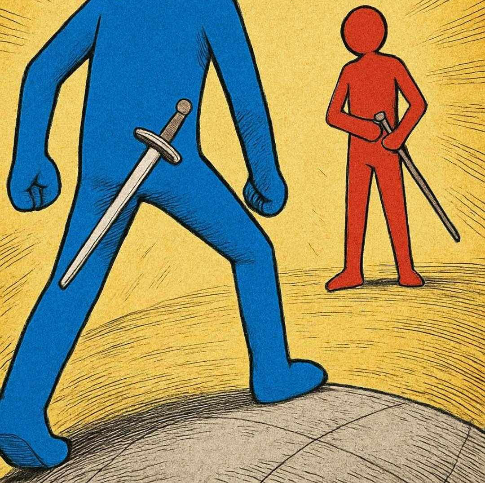

# 🗡️ Nidhogg Clone (Stickman Duel)

This is my attempt to recreate the cult classic game, Nidhogg, available on steam.

The result is a fast paced 2D dueling game, built with HTML, CSS and JavaScript.

Two bitter rivals, Red Man and Blue Man, face off in eternal conflict for our amusement. The first to land 3 kills is victorious. That is, until you hit the restart key.

---

## 🚀 Live Demo  
**Play it now on GitHub Pages:**  
👉 https://dreng0t.github.io/nidhogg-clone-dom/

---

## 🎮 Features

- ⚔️ **Sword Combat** with rotating sword animations  
- 🧠 **Bot AI** that chases and jumps up to platforms to follow the player  
- 🏃 **Sprite-based Movement** and animations for idle, run, jump, and attack  
- 🛡️ **Health Bar System** that visually depletes as damage is taken  
- 💥 **Victory System** — defeat your opponent 3 times to win the round  
- 📸 **Dynamic Death and Victory Screens** using custom images  
- 🌄 **Background Art** and immersive start screen

---

## 📖 Instructions

- Press A to move left
- Press D to move right
- Press W to jump
- Press J to attack
- upon defeating the bot (or getting defeated) press R to reset the fight from scratch

---

## 🧱 Technologies Used

- **HTML5** & **CSS3**
- **Vanilla JavaScript (ES6)**
- **DOM Manipulation**
- **CSS Animations**
- GitHub Pages for deployment
